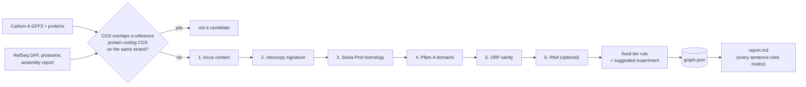

# gene-evidence

Auditable evidence for gene predictions that the reference annotation does not have.

<!-- IMAGE PLACEHOLDER: see docs/img/IMAGES.md (hero)

-->

[Carbon-A](https://huggingface.co/buckets/HuggingFaceBio/genbank-annotations) publishes protein-coding
gene predictions for thousands of GenBank assemblies. Some of the predicted loci are missing from the
species' reference annotation (NCBI RefSeq). Each of those is either a gene the reference missed or a
prediction artefact. `gene-evidence analyze` collects, for each such locus, the evidence a biologist would
otherwise gather by hand. It writes that evidence to an **evidence graph**, in which every node is one
tool output with its tool, version, database hash, parameters and raw values. From the graph it renders
a **report** in which every sentence cites the graph nodes it rests on.

There is no LLM and no learned model in this stage. The rules are fixed and written down in
[docs/EVIDENCE.md](docs/EVIDENCE.md).

**Status:** prototype, stage 1. Python, Apache-2.0. Read [Known limitation](#known-limitation) before
using the tiers to choose what to validate.

## What it does



1. **Candidates:** Carbon-A loci whose CDS overlaps no protein-coding CDS of the reference on the same
   strand. Without a reference, every locus is a candidate.
2. **Evidence, locus context first:**
   - what the reference annotates at the locus (pseudogene, non-coding gene, nothing);
   - a retrocopy signature (intronless candidate, near-identical to a multi-exon gene elsewhere);
   - Swiss-Prot homology (DIAMOND);
   - Pfam-A domains (pyhmmer, gathering thresholds);
   - ORF sanity;
   - optional RNA evidence from a transcript GTF.
3. **Tiers:** a fixed rule that puts the evidence against (pseudogene, retrocopy) first. It is a reading
   aid, not a prediction.
4. **A suggested validation experiment** per candidate, chosen by fixed rules: RT-PCR across a
   predicted splice junction, paralog-discriminating RT-PCR, ribosome profiling, or long-read cDNA.

## Why the evidence comes in this order

A processed pseudogene (retrocopy) is an intronless copy of a spliced mRNA. Gene predictors often call
it a gene, and the reference usually labels it `pseudogene`, so it overlaps no protein-coding CDS and
becomes a candidate. On exactly those loci the most persuasive-looking evidence points the wrong way:
a near-identical Swiss-Prot hit and intact Pfam domains are what a copy of a well-studied gene looks
like. So the locus context and the retrocopy signature are checked first, and either one puts the
candidate in tier 5 whatever the homology says. On the rat development run, 61 % of the candidates sit
on loci the reference already calls pseudogenes. Rules, thresholds and failure modes for every evidence
type are in [docs/EVIDENCE.md](docs/EVIDENCE.md).

| tier | name | rule (first match wins) |
|---|---|---|
| 5 | AGAINST-strong | pseudogene at the locus, or retrocopy signature (overrides FOR) |
| 1 | FOR-strong | Swiss-Prot homolog and ≥ 1 Pfam domain |
| 2 | FOR | Swiss-Prot homolog or ≥ 1 Pfam domain |
| 4 | AGAINST-weak | any ORF flag, and no FOR evidence |
| 3 | no evidence | everything else |

## Quickstart

Requires Python ≥ 3.9. Homology search needs the [DIAMOND](https://github.com/bbuchfink/diamond) binary
(tested with 2.1.10); domain search uses pyhmmer.

```bash
pip install -e '.[tools,test]'      # pyhmmer; DIAMOND is a separate binary
pytest -q                           # unit tests, synthetic fixtures, no network

# inputs (verified: Carbon-A sha256 from its metadata.json, NCBI md5checksums.txt)
gene-evidence fetch carbon    --gca GCA_036323735.1 --division vertebrate_mammalian --out data/carbon
gene-evidence fetch refseq    --release-url https://ftp.ncbi.nlm.nih.gov/genomes/all/annotation_releases/10116/GCF_036323735.1-RS_2024_02/ \
                   --gcf GCF_036323735.1 --out data/refseq
gene-evidence fetch swissprot --out data/sprot
gene-evidence fetch pfam      --out data/pfam

gene-evidence analyze --gca GCA_036323735.1 \
  --carbon-gff data/carbon/annotations.gff3.gz --carbon-proteins data/carbon/proteins.faa.gz \
  --ref-gff data/refseq/*_genomic.gff.gz --ref-proteins data/refseq/*_protein.faa.gz \
  --ref-report data/refseq/*_assembly_report.txt --ref-name GCF_036323735.1-RS_2024_02 \
  --swissprot data/sprot/uniprot_sprot.fasta.gz --pfam data/pfam/Pfam-A.hmm \
  --diamond ./diamond --top 100 --out out/

gene-evidence check-report out/report.md out/graph.json   # fails if any sentence lacks a valid citation
```

Omit `--ref-gff` to run without a reference: every Carbon-A locus is then a candidate, and the report
says so. `--rna-gtf` adds transcript overlap and exact splice-junction matches (recorded, not used for
tiering). `gene-evidence --help` lists every option.

`scripts/dev_run_rat.sh <workdir> <threads>` does all of the above on a disposable Linux VM (about
0.5 GB of downloads). Each stage leaves a marker and is skipped on a re-run, and the script runs the
analysis twice to check determinism.

## Inputs and outputs

**Inputs:** Carbon-A `annotations.gff3.gz` and `proteins.faa.gz` for one GenBank assembly (GCA); optionally
the RefSeq twin's `*_genomic.gff.gz`, `*_protein.faa.gz` and `*_assembly_report.txt` (GenBank names map
to RefSeq names through identical-sequence rows only); UniProtKB/Swiss-Prot FASTA; the Pfam-A HMM library;
optionally a transcript GTF.

**Outputs**, in one directory:

| file | what |
|---|---|
| `graph.json` | the evidence graph: one node per tool output (tool, version, database name/version/sha256, parameters, raw values), one node per rule, edges from each candidate to its evidence and rules |
| `report.md` | a ranked summary table, then one section per candidate: evidence FOR, evidence AGAINST, context, the predictor's own score (labelled as such) and a suggested validation experiment. Every sentence and table row cites `[node-id]`s |
| `versions.json` | tools, databases and inputs, with sha256 |
| `timings.json` | wall time per stage and peak RAM (kept out of the graph and report so those stay byte-stable) |
| `raw/` | the tool tables; a stage whose table exists is skipped, so an interrupted run resumes |

<!-- IMAGE PLACEHOLDER: see docs/img/IMAGES.md (report-example)

-->

## Development run: rat

`runs/2026-10-09-rat-dev/` holds a full run on *Rattus norvegicus*: Carbon-A on GCA_036323735.1 against
RefSeq GCF_036323735.1, annotation release RS_2024_02, with Swiss-Prot 2026_03, Pfam 38.2, DIAMOND 2.1.10
and pyhmmer 0.12.3. It is a development fixture. It shows that the pipeline runs and that its output is
auditable; it is not a test of ranking quality.

- 22,337 Carbon-A loci; 21,390 overlap a RefSeq protein-coding CDS on the same strand; **947 candidates**.
- Locus context: pseudogene 578 (61 %), nothing 285, protein-coding gene on the other strand or in an
  intron 45, non-coding gene 39. The retrocopy signature fired on 261.
- Tiers: 1 FOR-strong 223, 2 FOR 75, 3 no evidence 44, 4 AGAINST-weak 0, 5 AGAINST-strong 605.
- The top 100 are all tier 1, and dominated by repeat-rich families (32 Smok kinase hits, 24 T-cell
  receptor or immunoglobulin variable segments, 2 retroviral Pol polyproteins including rank 1). That
  is the multi-copy / transposon failure mode documented in [docs/EVIDENCE.md](docs/EVIDENCE.md).
- `gene-evidence analyze` took 364 s wall on 2 vCPUs (hmmsearch 211 s, DIAMOND 121 s); peak RSS 480 MB
  in Python, 797 MB in DIAMOND.

| path | what |
|---|---|
| `run1/report.md`, `run1/graph.json` | the top-100 report and its evidence graph |
| `run1/versions.json`, `run1/timings.json` | inputs, databases and their sha256; wall time and RAM |
| `all_candidates.tsv` | one row per candidate (all 947): tier, locus context, retrocopy, best hit, Pfam families, experiment |
| `determinism.txt` | sha256 of `graph.json` and `report.md` from two independent runs: identical |
| `check.txt` | `check-report` result on the committed report: PASS |
| `run.log`, `run*/gene-evidence.log` | the run log, with download verification |

The acceptance criteria and their results are in [BRIEF.md](BRIEF.md).

## Reproducibility

- **Deterministic:** two runs on the same inputs give byte-identical `graph.json` and `report.md`. The
  development run checks this with two independent runs (each with its own DIAMOND and hmmsearch); a unit
  test checks it on synthetic fixtures.
- **Versioned:** `versions.json` and the `db:*` graph nodes record every tool version and every input and
  database sha256. Downloads are verified against Carbon-A's `metadata.json` and NCBI's `md5checksums.txt`.
- **Traceable:** `check-report` fails on an uncited sentence or table row, or a citation to a node that
  does not exist. Text that comes from tools, such as protein names, is sanitised so that it cannot open
  a new sentence or forge a citation.

## CI

GitHub Actions runs the unit tests (`pytest`, synthetic fixtures, no network) on Python 3.9 and 3.12.

## Known limitation

The tiers have been checked against independent long-read transcript evidence on plant genomes. There,
the fixed tier ordering ranked supported candidates better than chance but worse than the gene
predictor's own confidence score, and demoting candidates on their AGAINST signals did not improve the
top of that ordering.

So use the report to **explain** each candidate (what the reference says at the locus, whether it looks
like a copy, what the homology and domains are, and which experiment would test it), not to **choose**
which candidates to validate first.

## What it does not claim

- That a tier-1 candidate is a real gene, or that tier 1 is enriched for real genes.
- That a tier-5 candidate is not a gene. Retrocopies can be expressed, and pseudogene calls can be
  wrong.
- That "no Swiss-Prot hit" means "novel".

## License and data

Apache-2.0 (see [LICENSE](LICENSE)).

Built on public resources: Carbon-A (MIT), NCBI RefSeq, UniProtKB/Swiss-Prot, Pfam, DIAMOND, pyhmmer.
The committed run contains derived results only; the databases themselves are downloaded by
`gene-evidence fetch` and are not redistributed here.
