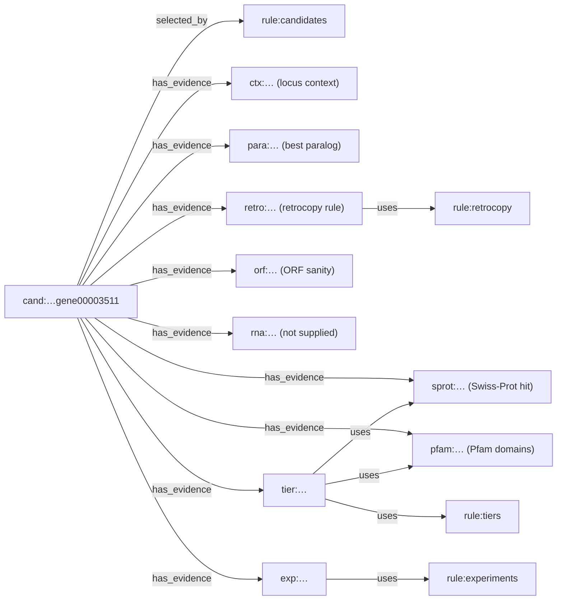

# Evidence types, rules and failure modes

Stage 1 of gene-evidence gathers six kinds of evidence for each candidate locus. A candidate is a
Carbon-A protein-coding locus whose CDS overlaps no reference protein-coding CDS on the same strand.
Every rule below is fixed in code (`src/gene_evidence/rules.py`) and copied into the evidence
graph as a `rule:*` node, so a report can be audited against the exact thresholds that produced it.
[BRIEF.md](../BRIEF.md) explains why the evidence comes in this order.

## The confound to keep in mind: pseudogenes and retrocopies

A processed pseudogene, or retrocopy, is a reverse-transcribed copy of a spliced mRNA that was
inserted back into the genome. It has no introns. Its sequence is nearly identical to the parent gene,
and its reading frame is often still intact enough for a gene predictor to call it a gene. Reference
annotations usually label these loci `pseudogene` rather than protein-coding. That is why they show up
as candidates: they overlap no protein-coding CDS.

So the most persuasive-looking evidence points the wrong way on exactly these loci. A
**near-identical** homolog in Swiss-Prot is what you would expect from a retrocopy of a well-studied
gene, and Pfam domains carry over from the parent too. Stage 1 therefore checks **locus context and the
retrocopy signature before homology and domains**. Either one puts the candidate in tier 5,
whatever the FOR evidence says. On the rat dev fixture, more than half of the candidates sit on loci
the reference already calls pseudogenes. See `runs/` for the measured fraction.

<!-- IMAGE PLACEHOLDER: see docs/img/IMAGES.md (rat-locus-context)

-->

## 1. Locus context (`ctx:*`)

- **What:** reference `gene`/`pseudogene` features that overlap the candidate's gene span on either
  strand, with their `gene_biotype`; the nearest reference protein-coding gene on the same sequence
  (either strand) and its distance in bp (0 if they overlap).
- **Rule:** the class is the first that matches, in this order: *pseudogene* (any overlapping biotype
  containing `pseudo`), *protein-coding gene*, *non-coding gene*, *nothing*.
- **Failure modes:** the reference can be wrong in both directions, because some pseudogene calls are
  outdated and some genes are missing. "Nothing at the locus" says what the reference contains, not
  what the genome encodes. Overlap uses the whole gene span, so a large intron-containing gene on the
  other strand gives the class *protein-coding gene* even when no exon is shared. Coordinates come
  through the assembly report's identical (`=`) sequences only. Loci on any other sequence are dropped
  and counted, not analysed. Immunoglobulin and T-cell receptor gene segments (`V_segment`,
  `C_region` biotypes) are protein-coding but need rearrangement. Their CDS counts for candidate
  selection, but this class rule files them under *non-coding gene*.

## 2. Retrocopy signature (`para:*`, `retro:*`)

- **What:** the candidate's CDS segment count, and its best DIAMOND blastp hit against the reference's
  own proteome (`para:*`, best = highest bitscore). The parent protein's CDS segment count and gene
  coordinates come from the reference GFF.
- **Rule (`rule:retrocopy`):** the signature fires iff the candidate has exactly 1 CDS segment, the
  best paralog has identity ≥ 90 % and query coverage ≥ 80 %, the parent CDS has ≥ 2 segments, and the
  parent gene does not overlap the candidate.
- **Failure modes:** an old retrocopy, below 90 % identity, is missed. A recent tandem duplicate of an
  intronless gene does not fire, by design. A real, functional retrogene fires, and some retrogenes are
  expressed and translated. Firing means "looks like a copy", not "is not a gene". Only the best hit is
  considered, so a candidate whose best hit is an intronless paralog does not fire even if a
  multi-exon parent ranks second.
- **Not available:** a frameshift flag. Carbon-A publishes only `status` (`complete`/`incomplete`) and
  the protein. Internal stops are detected from the protein string (`*` before the last position).

## 3. Homology (`sprot:*`)

- **What:** best DIAMOND blastp hit (default sensitivity, e ≤ 1e-5, up to 25 targets) against
  UniProtKB/Swiss-Prot: identity, query coverage, e-value, bitscore, protein name, organism, taxon id.
- **Rule (`rule:homolog`):** it is a homolog for tiering iff e ≤ 1e-5 **and** query coverage ≥ 50 %.
  A hit below that coverage is reported under *Context*, not as evidence.
- **Failure modes:** see the confound above. A near-identical hit can mean a retrocopy, and the hit can
  be the same-species protein of the parent gene. Swiss-Prot is small and curated, so "no hit" does not
  mean "novel". A low-complexity or repeat-derived protein can hit many unrelated entries.

## 4. Protein domains (`pfam:*`)

- **What:** pyhmmer `hmmsearch` of all Pfam-A HMMs against the candidate proteins, using each family's
  gathering threshold (`--cut_ga`). The report lists included domains with envelope coordinates and
  score.
- **Rule:** at least one included domain counts as FOR evidence. The number of distinct families
  orders candidates within a tier.
- **Failure modes:** domains survive in pseudogenes and retrocopies. Transposon-derived ORFs
  (reverse transcriptase, transposase domains) produce strong domain hits on loci that are not host
  genes. Gathering thresholds are family-specific and can miss divergent members. Large multi-copy
  families, such as the rodent Smok kinases and receptor variable segments, give strong domain and
  homology hits to every copy. On the rat dev run these filled most of tier 1 (see BRIEF.md).

## 5. ORF sanity (`orf:*`)

- **What:** leading `M`, protein length, internal stop, and Carbon-A's `status` and `confidence`.
- **Rule:** an ORF flag is no leading `M`, an internal stop, or `status` ≠ `complete`. Flags put a
  candidate with no FOR evidence in tier 4. They do not demote FOR evidence.
- **The predictor's own score:** Carbon-A's `confidence` is reported verbatim and labelled "the
  predictor's own score, not evidence". It is not used for tiering or ordering. See the README's
  *Known limitation*: in a later check against independent transcript evidence it ordered supported
  candidates better than the tiers did.

## 6. RNA evidence (`rna:*`, optional)

- **What:** with `--rna-gtf`, the transcripts that overlap the candidate on the same strand, and the
  predicted splice junctions that a transcript intron reproduces exactly. Without the GTF, the graph
  holds a recorded no-op node, `{"supplied": false}`.
- **Rule:** recorded only. Stage 1 does not use RNA for tiering.
- **Failure modes:** reads from the parent gene can mis-map to a retrocopy and the other way round.
  Transcription is not translation. BAM input is not supported in stage 1.

## Tiers (`rule:tiers`), a reading aid

| tier | name | rule (first match wins) |
|---|---|---|
| 5 | AGAINST-strong | pseudogene at the locus, or retrocopy signature (overrides FOR) |
| 1 | FOR-strong | Swiss-Prot homolog and ≥ 1 Pfam domain |
| 2 | FOR | Swiss-Prot homolog or ≥ 1 Pfam domain |
| 4 | AGAINST-weak | any ORF flag, and no FOR evidence |
| 3 | no evidence | everything else |

Within a tier, candidates are ordered by distinct Pfam families (descending), then best Swiss-Prot
bitscore (descending), then locus id. The tiers put the evidence against first. They do not claim that
tier 1 is enriched for real genes, and they are not a validation priority: see the README's
[Known limitation](../README.md#known-limitation).

## Validation experiment (`rule:experiments`)

| rule | when | experiment |
|---|---|---|
| 1 | tier 5 with a retrocopy signature or a paralog hit | paralog-discriminating RT-PCR (primers on positions that differ from the closest paralog) |
| 2 | tier 5 without a paralog hit | long-read cDNA sequencing across the locus |
| 3 | ≥ 2 CDS segments | RT-PCR across the first predicted splice junction (coordinates and intron size in the report) |
| 4 | one CDS segment, protein < 100 aa | ribosome profiling |
| 5 | one CDS segment, protein ≥ 100 aa | long-read cDNA sequencing |

## Traceability

Every sentence and table row of `report.md` cites graph nodes as `[node-id]`. The graph around one
candidate (rank 1 of the rat dev run, `runs/2026-10-09-rat-dev/run1/graph.json`) looks like this:

(Edges abridged: `tier:` also uses `ctx:`, `orf:` and `retro:`; `retro:` and `exp:` also use `para:`
and `orf:`.)

Each evidence node carries the tool name and version, the database name, version and sha256, the
parameters and the raw values. A report line such as *"Best Swiss-Prot hit … [sprot:…] [rule:homolog]"*
can be checked against those nodes. `gene-evidence check-report
report.md graph.json` fails when a sentence has no citation or cites a node that does not exist. Text
that comes from tools, such as protein names, is sanitised so that it can open neither a new sentence
nor a fake citation.
